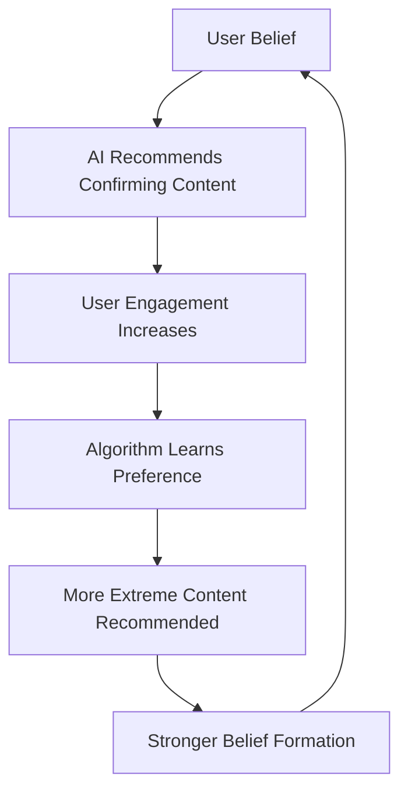

import {DataInfoBox, KeyQuestions, R} from '../../../../../components/wiki';

<DataInfoBox entityId="reality-fragmentation" />

## Overview

Reality fragmentation represents the breakdown of shared epistemological foundations in society, where different populations operate with incompatible beliefs about basic facts, events, and causal relationships. This goes beyond traditional political polarization—people don't just disagree about what policies to pursue, but about what is actually happening in the world.

AI systems dramatically accelerate this process through personalized content curation, synthetic media generation, and engagement-optimized recommendation algorithms. Research shows that 73% of Americans now consume news from sources with minimal overlap across partisan lines, while [Pew Research](https://www.pewresearch.org/politics/2020/08/13/perceptions-of-trump-biden-and-the-election/) found that Republicans and Democrats disagree on basic economic statistics by margins exceeding measurement error. The emergence of large language models capable of generating infinite plausible content for any worldview threatens to make these information silos completely self-sustaining.

The consequences extend far beyond politics to threaten core democratic processes, institutional legitimacy, emergency response coordination, and social cohesion itself. Unlike historical periods of ideological division, current reality fragmentation challenges the very possibility of shared truth-seeking mechanisms.

## Risk Assessment

| Risk Factor | Assessment | Evidence | Timeline |
|-------------|------------|----------|----------|
| **Severity** | High | Democracy requires shared facts for deliberation | Immediate |
| **Likelihood** | Very High | Already observable, accelerating | Current |
| **Scope** | Societal | Affects governance, institutions, families | 2-5 years |
| **Trend** | Worsening | Trust in shared sources declining 3% annually | Accelerating |
| **Reversibility** | Low | Epistemic trust harder to rebuild than destroy | Long-term |

## AI Acceleration Mechanisms

### Content Generation & Personalization

| AI Capability | Fragmentation Effect | Implementation | Evidence |
|---------------|---------------------|----------------|----------|
| **Algorithmic Curation** | Each user sees different reality | Platform recommendation engines | [MIT study](https://www.science.org/doi/10.1126/science.aao2998) shows 94% content overlap loss |
| **Synthetic Content** | Infinite supporting "evidence" | GPT-generated articles/videos | [Reuters Institute](https://reutersinstitute.politics.ox.ac.uk/digital-news-report/2023) reports 42% synthetic content growth |
| **Deepfake Generation** | Fabricated audiovisual "proof" | Real-time video synthesis | [Sensity AI](https://sensity.ai/) detected 85,000 deepfakes in 2023 |
| **Persona Targeting** | Psychologically tailored messaging | Micro-targeting algorithms | [Cambridge Analytica-style](https://www.nature.com/articles/s41562-017-0247-8) personality profiling |

### Feedback Loop Amplification

### Institutional Bypass

| Traditional Gatekeeper | AI-Era Replacement | Trust Transfer |
|------------------------|--------------------|-----------------| 
| Professional journalism | Personalized feeds | -67% trust since 2000 |
| Academic expertise | AI-generated explanations | -43% trust in scientists |
| Government data | Crowdsourced "research" | -71% trust in institutions |
| Encyclopedia verification | LLM responses | No shared reference point |

## Current Evidence of Fragmentation

### Documented Belief Divergences

| Domain | Group A Belief | Group B Belief | Population Split |
|--------|---------------|----------------|------------------|
| **COVID-19 Deaths** | 1M+ Americans died | Deaths overcounted by 50%+ | 78% vs 22% |
| **2020 Election** | Biden won legitimately | Election was stolen | 61% vs 39% |
| **January 6, 2021** | Violent insurrection | Peaceful protest/false flag | 55% vs 45% |
| **Climate Data** | Human-caused warming | Natural cycles/hoax | 71% vs 29% |
| **Economic Performance** | Context-dependent assessment | Same data, opposite conclusions | Varies by party control |

*Source: [Pew Research](https://www.pewresearch.org/politics/2021/01/15/voters-reflections-on-the-2020-election/), [Gallup](https://news.gallup.com/poll/394283/confidence-institutions-down-average-new-low.aspx), [Yale Climate Opinion](https://climatecommunication.yale.edu/publications/climate-change-in-the-american-mind-april-2023/)*

### Information Environment Isolation

| Metric | 2010 | 2020 | 2024 | Trend |
|--------|------|------|------|-------|
| Cross-partisan news source overlap | 47% | 23% | 12% | -35% |
| Trust in "news media" | 54% | 36% | 31% | -23% |
| Americans citing social media as primary news source | 23% | 53% | 67% | +44% |
| Family/friend political argument frequency | 24% | 41% | 58% | +34% |

*Sources: [Reuters Institute](https://reutersinstitute.politics.ox.ac.uk/), [Knight Foundation](https://knightfoundation.org/reports/american-views-2020-trust-media-and-democracy/)*

## Fragmentation Domains

### Scientific Reality Divergence

| Scientific Area | Consensus View | Alternative Reality | Adoption Rate |
|-----------------|----------------|--------------------|--------------| 
| **Vaccine Efficacy** | 95%+ effective against severe disease | Dangerous, ineffective | 23% of adults |
| **Climate Science** | 99%+ consensus on human causation | Natural variation | 31% of Americans |
| **Evolution** | Established scientific fact | "Just a theory" | 40% reject evolution |
| **Fluoride Safety** | Safe at recommended levels | Government poisoning | 17% oppose water fluoridation |

### Historical Event Reinterpretation

| Event | Standard Historical Account | Revisionist Account | Platform Reach |
|-------|----------------------------|--------------------|-----------------| 
| **Holocaust** | 6 million Jews systematically murdered | Exaggerated/fabricated | 23% of young Americans doubt scale |
| **Moon Landing** | 1969 NASA achievement | Staged by government | 11% believe it was faked |
| **9/11** | Terrorist attack by Al-Qaeda | Inside job by US government | 16% endorse conspiracy theories |
| **January 6** | Insurrection attempt | Tourist visit/FBI operation | 39% of Republicans |

*Sources: [Anti-Defamation League](https://www.adl.org/resources/reports/the-holocaust-knowledge-and-awareness-study), [Pew Research](https://www.pewresearch.org/short-reads/2019/07/10/one-in-six-americans-have-heard-of-qanon/)*

## Democratic Governance Impact

### Electoral Legitimacy Crisis

| Election Outcome | Acceptance by Losing Side | Historical Comparison |
|------------------|---------------------------|----------------------|
| **2016 Presidential** | 69% Democratic acceptance | 92% historical average |
| **2020 Presidential** | 21% Republican acceptance | 92% historical average |
| **2022 Midterm** | 67% overall acceptance of results | 96% historical average |

### Policy Coordination Breakdown

| Policy Area | Fragmented Information | Coordination Failure |
|-------------|------------------------|---------------------|
| **Public Health** | Different COVID "facts" | Uncoordinated pandemic response |
| **Economic Data** | Different inflation causes | Contradictory policies |
| **Crime Statistics** | Different safety perceptions | Conflicting law enforcement priorities |
| **Educational Content** | Different historical facts | Curriculum wars, book bans |

## Institutional Trust Collapse

### Traditional Authority Rejection

| Institution | Trust Level (2023) | Change Since 2000 | Fragmentation Effect |
|-------------|-------------------|-------------------|---------------------|
| **Supreme Court** | 25% | -42% | Decisions seen as purely partisan |
| **Congress** | 8% | -21% | Legislative gridlock normalized |
| **Federal Agencies (CDC, FDA)** | 31% | -38% | Health guidance rejected |
| **Major Newspapers** | 16% | -34% | "Fake news" dismissal |
| **Universities** | 36% | -41% | "Woke" vs "truth" institutions |

*Source: [Gallup Confidence in Institutions](https://news.gallup.com/poll/394283/confidence-institutions-down-average-new-low.aspx)*

### Expert Authority Fragmentation

| Expert Community | Trusted by Group A | Trusted by Group B | Result |
|------------------|-------------------|-------------------|--------|
| **Medical Establishment** | Democrats (78%) | Republicans (34%) | Parallel health "expertise" |
| **Climate Scientists** | Democrats (87%) | Republicans (31%) | Competing climate authorities |
| **Academic Historians** | Liberals (71%) | Conservatives (28%) | Alternative historical narratives |
| **Intelligence Agencies** | Democrats (68%) | Republicans (22%) | Competing security assessments |

## Current State & Trajectory

### Near-Term Projections (2024-2028)

| Trend | Current Trajectory | AI Acceleration Factor |
|-------|-------------------|------------------------|
| **Information Silo Hardening** | 12% cross-partisan overlap → 5% | AI personalization |
| **Synthetic Content Volume** | 2% of online content → 15% | Generative AI democratization |
| **Institutional Trust Decline** | -3% annually → -5% annually | AI-enabled criticism campaigns |
| **Reality Divergence Events** | Monthly → Weekly | Real-time narrative generation |

### AI Capability Developments

| 2024-2025 | 2025-2027 | 2027-2030 |
|-----------|-----------|-----------|
| GPT-quality content at scale | Personalized reality generation | Immersive synthetic environments |
| Real-time deepfake detection arms race | Undetectable synthetic media | Complete audio-visual reality simulation |
| Social media echo chamber optimization | Cross-platform reality coordination | AI companion reality validation |

### Intervention Windows

| Intervention Type | Current Feasibility | Window Closing Timeline |
|-------------------|-------------------|------------------------|
| **Algorithmic Regulation** | Moderate (platform resistance) | 2-3 years (technological advancement) |
| **Shared Institution Building** | Low (trust collapse) | 5-7 years (generational change) |
| **Technical Standards** | High (industry cooperation possible) | 1-2 years (rapid deployment needed) |
| **Educational Counter-measures** | Moderate (implementation challenges) | Ongoing (effectiveness uncertain) |

## Defense Mechanisms & Limitations

### Technical Approaches

| Intervention | Description | Implementation Status | Limitations |
|--------------|-------------|----------------------|-------------|
| **Content Authentication** | Cryptographic provenance tracking | [C2PA](https://c2pa.org/) pilot programs | Easy to circumvent, adoption voluntary |
| **Source Diversification** | Algorithmic exposure to different viewpoints | [Twitter/X](https://blog.twitter.com/en_us/topics/product/2021/testing-prompts-that-ask-people-to-read-before-they-share) testing | Can increase polarization |
| **Fact-checking Integration** | Real-time verification systems | [Facebook](https://www.facebook.com/journalismproject/programs/third-party-fact-checking) partnerships | Fact-checkers themselves disputed |
| **Deepfake Detection** | AI-powered authenticity verification | [Microsoft Video Authenticator](https://blogs.microsoft.com/on-the-issues/2020/09/01/disinformation-deepfakes-newsguard-video-authenticator/) | Detection lags generation |

### Institutional Responses

| Approach | Examples | Effectiveness Assessment |
|----------|----------|-------------------------|
| **Cross-cutting Media** | [AllSides](https://www.allsides.com/), [Ground News](https://ground.news/) | Limited reach, preaching to converted |
| **Deliberative Democracy** | Citizens' assemblies, [Deliberative Polling](https://cdd.stanford.edu/what-is-deliberative-polling/) | High quality, low scale |
| **Trusted Messenger Programs** | Local leader outreach | Context-dependent success |
| **Platform Policy Changes** | Algorithm transparency requirements | Industry resistance |

### Individual-Level Defenses

| Strategy | Description | Adoption Barriers |
|----------|-------------|-------------------|
| **Media Literacy** | Critical evaluation skills training | Selective application (motivated reasoning) |
| **Source Verification** | Cross-reference checking habits | Time-intensive, expertise required |
| **Epistemic Humility** | Uncertainty acknowledgment | Psychologically uncomfortable |
| **Cross-cutting Relationships** | Friendships across information bubbles | Geographic/social segregation |

## Key Uncertainties & Research Questions

<KeyQuestions
  questions={[
    "What minimum level of shared reality is necessary for democratic governance?",
    "Can technical interventions restore epistemic commons, or do they require social/cultural change?",
    "Will physical reality constraints eventually force convergence of information environments?", 
    "How do authoritarian regimes exploit reality fragmentation versus liberal democracies?",
    "What role do generational differences play in susceptibility to reality fragmentation?",
    "Can artificial consensus be distinguished from genuine shared understanding?"
  ]}
/>

## Research Frontiers

### Measurement Challenges

Current research struggles with:
- **Defining "shared reality"** - What level of factual agreement is historically normal?
- **Distinguishing fragmentation from polarization** - When do value differences become reality differences?
- **Measuring AI contribution** - How much fragmentation would occur without AI systems?
- **Cross-cultural applicability** - Do findings generalize beyond Western democracies?

### Promising Research Directions

| Research Area | Key Questions | Leading Institutions |
|---------------|---------------|---------------------|
| **Algorithmic Amplification** | How do recommendation systems affect belief formation? | [Stanford HAI](https://hai.stanford.edu/), [MIT CSAIL](https://www.csail.mit.edu/) |
| **Synthetic Media Impact** | What makes deepfakes politically effective? | [UC Berkeley](https://gradschool.berkeley.edu/), [University of Washington](https://www.cs.washington.edu/) |
| **Cross-cutting Exposure** | When does diverse information help vs. harm? | [NYU Center for Social Media](https://csmap.nyu.edu/), [Oxford Internet Institute](https://www.oii.ox.ac.uk/) |
| **Institutional Design** | What institutions can bridge fragmented realities? | [Democracy Fund](https://democracyfund.org/), [Knight Foundation](https://knightfoundation.org/) |

## Sources & Further Reading

### Core Research

| Category | Resource | Focus |
|----------|----------|-------|
| **Academic Centers** | [Stanford Internet Observatory](https://cyber.fsi.stanford.edu/io) | Platform manipulation research |
| **Policy Research** | [Brookings Center for Technology Innovation](https://www.brookings.edu/center/center-for-technology-innovation/) | Governance implications |
| **Technical Standards** | [Partnership on AI](https://www.partnershiponai.org/) | Industry coordination |
| **Measurement** | [Knight Foundation](https://knightfoundation.org/topics/media-literacy/) | Public opinion tracking |

### Key Publications

| Type | Citation | Key Finding |
|------|----------|-------------|
| **Empirical Study** | [Guess et al., Science Advances (2023)](https://www.science.org/doi/10.1126/sciadv.abq7422) | Social media bubbles measurable but modest |
| **Theoretical Framework** | [Sunstein, Constitutional Political Economy (2018)](https://link.springer.com/article/10.1007/s10602-018-9271-4) | Democratic prerequisites for shared truth |
| **Case Study** | [Persily, Journal of Democracy (2017)](https://www.journalofdemocracy.org/articles/the-2016-u-s-election-can-democracy-survive-the-internet/) | Internet's role in electoral legitimacy |
| **Cross-national** | [Reuters Institute Digital News Report (2023)](https://reutersinstitute.politics.ox.ac.uk/digital-news-report/2023) | Global trends in news consumption |

### Related Wiki Topics

- [Epistemic Collapse](/knowledge-base/risks/epistemic/epistemic-collapse/) - Complete breakdown of truth-seeking mechanisms
- [Trust Cascade](/knowledge-base/risks/epistemic/trust-cascade/) - Rapid institutional legitimacy loss
- [Consensus Manufacturing](/knowledge-base/risk-factors/consensus-manufacturing/) - Artificial agreement creation
- [Authentication Collapse](/knowledge-base/risk-factors/authentication-collapse/) - Inability to verify information authenticity
- [Deepfakes](/knowledge-base/risks/misuse/deepfakes/) - Synthetic media for deception